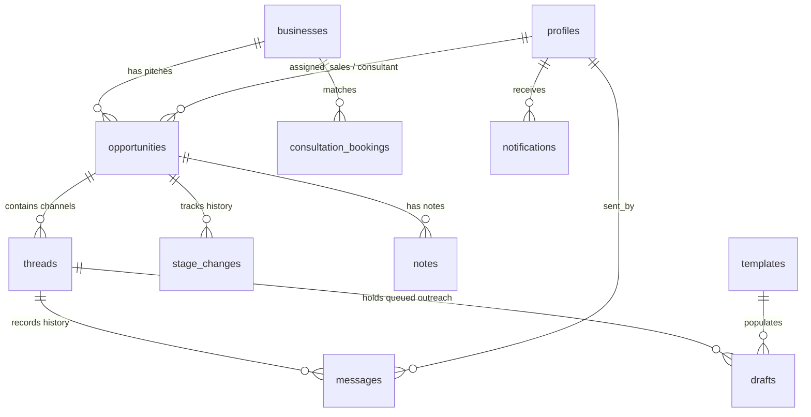

# Selfera Sales Pipeline - Comprehensive Project Overview

> **Version:** 2.0 (Active Architecture)  
> **Last Updated:** October 2026  
> **Stack:** Next.js 16 (App Router) · PostgreSQL (Supabase) · Meta WhatsApp Cloud API · SMTP/IMAP · Vercel

---

## 1. Executive Summary

**Selfera Sales Pipeline** is an enterprise multi-channel sales pipeline and outreach management system designed for Selfera. The platform empowers sales representatives and account managers to identify prospective small-to-medium businesses, engage them across diverse communication channels (WhatsApp, Email, Instagram, Facebook, Phone, and Walk-in), track replies in real-time, and systematically transition interested leads to consultants for booking and closing.

### Core Architectural Principles
1. **Human-in-the-Loop Outreach:** Automatic unsolicited blast messages are strictly prohibited. Every single outbound communication is queued, reviewed, and dispatched only upon deliberate human confirmation.
2. **Database-Driven Business Logic:** Complex stage transitions, follow-up cadence calculation, working-day schedules, and status aggregations reside entirely within PostgreSQL stored procedures (`sales-pipe` schema). The frontend remains clean, decoupled, and declarative.
3. **Cross-Platform Thread Coordination:** Prospects can be contacted on multiple platforms simultaneously; however, receiving an inbound response on any platform instantly pauses active outreach sequences across all other platforms.
4. **Environment Isolation & Dual-Write Safeguards:** Strict multi-environment separation across **Development**, **Staging**, and **Production**, with real-time unidirectional replication (`Production -> Staging`) enabled exclusively in Production.

---

## 2. Technology Stack & Key Integrations

| Layer | Technologies / Services | Purpose |
| :--- | :--- | :--- |
| **Frontend Framework** | **Next.js 16 (App Router)**, React 19, TypeScript | High-performance server-rendered and client-interactive UI |
| **Typography & Styling** | **Geist Font**, Tailwind CSS / CSS Variables | Clean, modern typography and enterprise UI tokens |
| **Database & Auth** | **Supabase (PostgreSQL 15+)** | Custom schema `"sales-pipe"`, RLS policies, triggers, and Auth |
| **API Architecture** | **Next.js Server Actions & Route Handlers** | REST endpoints (`/api/send`, `/api/whatsapp/webhook`, etc.) |
| **Messaging (WhatsApp)**| **Meta WhatsApp Cloud API (Graph API v21.0)** | Direct template-based messaging (`selfera_sales_pipeline_general`) |
| **Messaging (Email)** | **Nodemailer (SMTP)** & **node-imap (IMAP)** | Direct outbound delivery and bi-directional inbox synchronization |
| **Data Replication** | **Custom Dual-Write Layer** (`src/lib/dual-write.ts`) | Unidirectional replication from Production to Staging |
| **Deployment** | **Vercel** | Edge runtime, production hosting, automated preview deployments |

---

## 3. Database Architecture (`sales-pipe` Schema)

All tables, views, and functions reside under the custom schema `"sales-pipe"`, ensuring zero collision with default Supabase tables or other microservices (`hr`, `shared`, `public`, `auth`).

### Entity Relationship Diagram (v2 Architecture)



### Table Dictionary (15 Active Tables)

| # | Table Name | Purpose |
| :---: | :--- | :--- |
| 1 | **`businesses`** | Account master record (business name, category, tier, contact details, address, postal code, website, social handles). |
| 2 | **`opportunities`** | Individual pitch / deal (associated business, pitched services, sales stage, assigned sales rep, assigned consultant). |
| 3 | **`threads`** | Dedicated conversation channel per platform (WhatsApp, Email, Instagram, Facebook, Phone, Walk-in) with thread status. |
| 4 | **`messages`** | Historical record of all outbound, inbound, and system messages sent or received. |
| 5 | **`drafts`** | Pre-generated message drafts tailored to a step and platform, awaiting user review and dispatch. |
| 6 | **`templates`** | 45 starter outreach message templates categorized by platform, service, and cadence step. |
| 7 | **`cadence_rules`** | Working-day delay rules governing outreach cadences (Follow-up 1, Follow-up 2, Follow-up 3, Went Cold). |
| 8 | **`profiles`** | Team member profiles linked to `auth.users` with defined roles (`admin`, `sales`, `consultant`) and capacity. |
| 9 | **`stage_changes`** | Immutable audit trail recording each stage transition, timestamp, and responsible user. |
| 10 | **`notifications`** | In-app user notifications for new replies, task reminders, and consultation assignments. |
| 11 | **`notes`** | User notes and internal discussions regarding an opportunity. |
| 12 | **`consultation_bookings`**| Incoming website consultation bookings matched to opportunities. |
| 13 | **`app_logs`** | Application lifecycle events, background sync jobs, and system health metrics. |
| 14 | **`user_logs`** | Salesperson action audits, lead updates, and manual modifications. |
| 15 | **`error_logs`** | Client and server runtime error traces, failed deliveries, and debug contexts. |

---

## 4. Multi-Environment & Replication Setup

The project uses three distinct Supabase PostgreSQL instances corresponding to development, staging, and production:

```
[ Local / Dev Environment ]   -->  Dev DB: thqtmbsnvsabcqsywgcu
[ Staging Environment ]       -->  Staging DB: beynoxkdekvxnulpxdwu
[ Production Environment ]    -->  Production DB: peyesxootjhnesgywbwy
                                         │
                                         ▼ (Unidirectional Dual-Write)
                                    Staging DB
```

### Database Parity
- **Tables:** Exactly 15 tables across DEV, STAGING, and PROD.
- **Routines:** Exactly 53 stored functions and triggers across all 3 databases.
- **PostgREST Exposure:** Authenticator role configured with:
  `pgrst.db_schemas = 'public, graphql_public, hr, project_management, shared, incident-management, selfera, prompt-lib, sales-pipe'`

### Production-to-Staging Dual-Write
To keep staging continuously tested against live production traffic without creating circular write loops:
- Controlled by `src/lib/dual-write.ts`.
- Operates **only** when `NEXT_PUBLIC_APP_ENV=production` and `DUAL_WRITE_ENABLED=true`.
- Safely writes to secondary Staging using its dedicated service role key.
- Hooked into:
  - Direct message delivery (`/api/send`)
  - Meta WhatsApp webhooks (`/api/whatsapp/webhook`)
  - CSV lead imports (`/api/leads/import`)
  - RPC mutation calls (`actions.ts`)

---

## 5. Sales Pipeline Lifecycle & Cadence

```
                               ┌──────────────────────────────────────────────┐
                               │                 Needs review                 │
                               └──────────────────────┬───────────────────────┘
                                                      │ (Approve import)
                                                      ▼
                               ┌──────────────────────────────────────────────┐
                               │                    Active                    │
                               └───────────┬──────────────────────┬───────────┘
                                           │ (Outreach sent)      │ (No reply)
                                           ▼                      ▼
                               ┌──────────────────────┐   ┌───────────────────┐
                               │     Contacted        │   │    Went Cold /    │
                               │   (Awaiting reply)   │   │    No response    │
                               └───────────┬──────────┘   └───────────────────┘
                                           │ (Prospect replies)
                                           ▼
                               ┌──────────────────────────────────────────────┐
                               │                 Interested                   │
                               └──────────────────────┬───────────────────────┘
                                                      │ (Handover to consultant)
                                                      ▼
                               ┌──────────────────────────────────────────────┐
                               │                 Consultation                 │
                               └──────────────────────┬───────────────────────┘
                                                      │ (Deal closed)
                                                      ▼
                               ┌──────────────────────────────────────────────┐
                               │                     Won                      │
                               └──────────────────────────────────────────────┘
```

### Working-Day Cadence Engine
Cadence calculations ignore weekends using `sales-pipe.add_working_days()`:
- **First Contact** → Scheduled upon import approval.
- **Follow-up 1:** +3 working days after First contact.
- **Follow-up 2:** +5 working days after Follow-up 1.
- **Follow-up 3 (Final Check):** +14 working days after Follow-up 2.
- **Went Cold:** +14 working days after Final check if no response.

---

## 6. Directory Structure

```
selfera-sales/
├── .env.development            # Environment variables for dev (Dev DB)
├── .env.staging                # Environment variables for staging (Staging DB)
├── .env.production             # Environment variables for production (Prod DB + dual write)
├── docs/                       # Architecture and setup documentation
│   ├── admin-setup.md          # Database migration & admin setup instructions
│   ├── developer-guide.md      # Ground rules, database RPC dictionary, workflows
│   └── sales-dashboard-staff-setup-guide.md
├── n8n/                        # Legacy n8n automation workflows
├── public/                     # Static media, icons, and branded assets
├── src/
│   ├── app/
│   │   ├── login/              # Enterprise login screen with branded preloader
│   │   ├── api/
│   │   │   ├── auth/           # Cookie & session management
│   │   │   ├── leads/import/   # CSV lead bulk import endpoint
│   │   │   ├── send/           # Multi-platform dispatch (WhatsApp / Email)
│   │   │   └── whatsapp/webhook/ # Meta Webhook for inbound WhatsApp replies
│   │   ├── dashboard/          # Main dashboard views & server actions
│   │   ├── globals.css         # Design system tokens and styling
│   │   └── layout.tsx          # Root application layout
│   ├── components/
│   │   ├── Preloader.tsx       # Smooth branded loading state
│   │   ├── Sidebar.tsx         # Navigation sidebar with role scoping
│   │   ├── Topbar.tsx          # Top bar with status and notifications
│   │   └── v2/                 # v2 Component suite:
│   │       ├── ChatInterface.tsx    # Live multi-channel conversation thread viewer
│   │       ├── CsvImportModal.tsx   # CSV upload & preview modal
│   │       └── LeadsManagement.tsx  # Kanban and card-based lead pipeline
│   ├── lib/
│   │   ├── auth.ts             # Auth session helpers and user extraction
│   │   ├── auth-service.ts     # Enterprise authentication service
│   │   ├── dual-write.ts       # Unidirectional Prod-to-Staging replication
│   │   ├── env.ts              # Type-safe environment validation
│   │   ├── imap.ts             # IMAP mailbox listener and UID tracker
│   │   ├── sending.ts          # Outreach dispatch orchestration
│   │   ├── whatsapp.ts         # Meta WhatsApp Cloud API client
│   │   └── supabase/
│   │       ├── client.ts       # Browser Supabase client (Anon Key)
│   │       ├── server.ts       # Server-side Supabase client (Cookies)
│   │       └── middleware.ts   # Next.js route protection & token refresh
│   └── types/                  # TypeScript interface declarations
└── supabase/
    └── migrations/             # SQL migrations for v2 architecture & fixes
```

---

## 7. Operational & Development Guide

### 1. Local Development
```bash
# Install dependencies
npm install

# Start development server on port 3000
npm run dev
```

### 2. Running Database Migrations
Migrations are maintained under `supabase/migrations/`. When applying updates to Supabase:
1. Target the correct database instance (Dev, Staging, or Prod).
2. Execute migrations using Supabase CLI or SQL Editor.
3. Reload PostgREST schema cache:
   ```sql
   NOTIFY pgrst, 'reload schema';
   ```

### 3. Branching & Git Strategy
- **`dev`**: Active feature development and pair-programming branch.
- **`staging`**: Pre-production integration branch (connects to Staging DB).
- **`main`**: Production deployment branch (connects to Production DB on Vercel).
- Standard flow: `feature-branch` → `dev` → `staging` → `main`.

---

## 8. Security & Compliance Checklist

- [x] **Service Role Key Security:** Server-only execution; never bundled in client bundles or public repositories.
- [x] **Row Level Security (RLS):** Enabled across all 15 tables in schema `"sales-pipe"`.
- [x] **Audit Trail:** Every stage change, outbound message, and user action logged to `stage_changes`, `messages`, and `user_logs`.
- [x] **Schema Isolation:** Schema `"sales-pipe"` completely separated from default `public` and other system namespaces.
